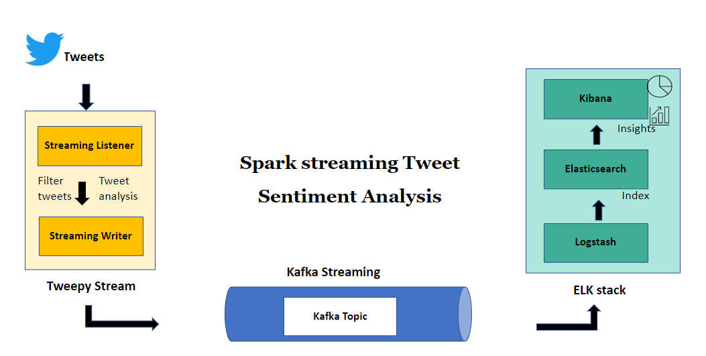

# PysparkStreamingAnalysis
 
## Problem statement: 
Create a Pyspark Streaming application that will continuously read data from Twitter, analyze them for their sentiment (sentiment classification - positive, neutral, negative), and send the sentiment values to Apache Kafka topic. Read the sentiment data from kafka topic using ElasticsearchLogstashKibana and visualize.
  
## Architecture: 

  
     
## Steps to implement:  

1.	Start the zookeeper server: 
.\zookeeper-server-start.bat ..\..\config\zookeeper.properties inside kafka\bin\windows

2. Start the Kafka server: 
.\kafka-server-start.bat ..\..\config\server.properties inside kafka\bin\windows

3. Create kafka topic: (inside kafka\bin\windows)
.\kafka-topics.bat --create --bootstrap-server localhost:9092 --replication-factor 1 --partitions 1 --topic twittersenti 

4. Configure Logstash (logstash.conf) to read from kafka topic i.e. source and write to elasticsearch index.  

	*input {* 
	 *kafka {*  
	    *bootstrap_servers => "localhost:9092"*
	     
	    *topics => "sentiments"*
	     
	    *}* 
	     
	*}*  

	*output {*  
	  *elasticsearch {*  
	    *hosts => ["http://localhost:9200"]*  
		*index => "sentiments"*  
	  *}* 
	*} *

5. Start elastic search by running the command elasticsearch inside the bin directory of elasticsearch  

6. Start logstash by running the following command inside logstash folder
 bin\logstash.bat -f config\logstash.conf 

7. Start Kibana by running the command .\kibana.bat inside the bin directory of kibana  

8. To check if elastic search is working fine, type the following command and you should see the attached output  
   &nbsp;&nbsp;  http://localhost:9200/_cat/indices/twittersenti  
This should display the health status as yellow denoting that index is set. 

9. Run the read_tweets.py followed by write_tweets.ipynb  
	○	#covid tweets are filtered  
	○	Once the last cell of the write_tweets.ipynb is run, tweets gets classified based on sentiments and kibana displays real-time insights  

10. Enter http://localhost:5601/
	○	Create index pattern: Stack Management => Data Views => Create Data Views 
	○	In the ‘Discover’ section, choose the kafka topic twittersenti 
	○	Real-time statistics on tweets will then be displayed 
	○	To generate graphs, create them in the dashboard with required fields. 

	  
	  
	  

