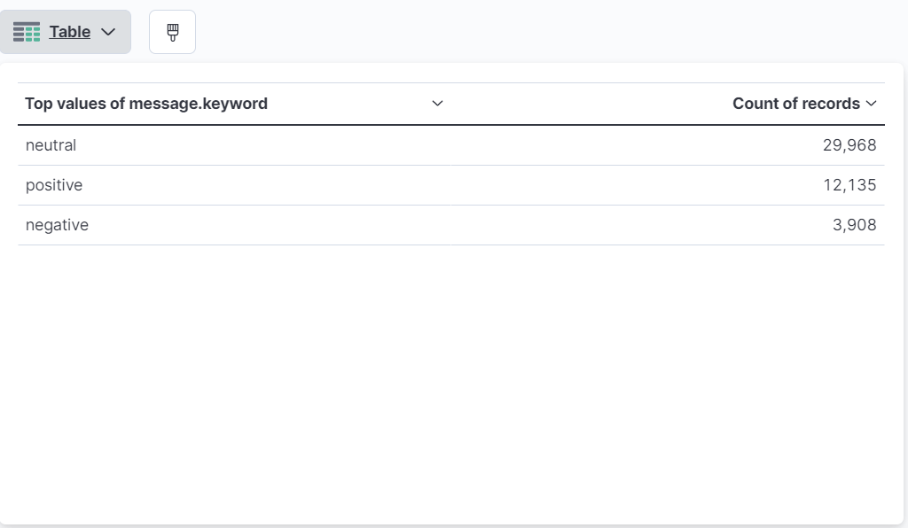

# PysparkStreamingAnalysis
 
Problem statement: 
Create a Pyspark Streaming application that will continuously read data from Twitter, analyze them for their sentiment (sentiment classification - positive, neutral, negative), and send the sentiment values to Apache Kafka topic. Read the sentiment data from kafka topic using ElasticsearchLogstashKibana and visualize.
  
    
   **Twitter -> Spark -> sentiments -> kafka -> ELK**  
     
Steps to implement:  
1. Create a PySpark application that continuously reads tweets from Twitter relating to a search term e.g. #covid.
2. Create a topic for data exchange. The Spark Structured Streaming application should send sentiment data to Kafka.
3. Analyze the gathered tweets for their individual sentiment continuously. At the end of every window, a message containing the sentiment
should be sent to Kafka topic created above.
4. Configure Logstash, Elasticsearch, and Kibana to read from the Kafka topic and set up visualization of sentiment.
 
Required Libraries:  
Tweepy
nltk  

Pre-requirements:  
1. Start kafkaserver and create a topic to transfer sentiment data - 'sentiments'.
2. Configure Logstash (logstash.conf) to read from kafka topic i.e. source and write to elasticsearch index. 
*
input {  
  kafka { 
    bootstrap_servers => "localhost:9092"  
    topics => "sentiments"  
    } 
}
 
output { 
  elasticsearch { 
    hosts => ["http://localhost:9200"]  
	index => "sentiments"  
  } 
} 
*
4. Start ELK services.

Modules:  
twitterReader.py - To conitunously read tweets for the given hashtag #covid and is make available at TCP socket port 5555.
 
kafkaWritter.py - Reads stream of tweets from TCP sockets, pre-process, classify sentiments and the value sent to kafka topic 'sentiments'.
 
Execution:  
1. Execute twitterReader.py followed by kafkaWritter.py.
2. A new index 'sentiments' will be available in elasticsearch and the same can be visualized in Kibana like below.  
 
 

